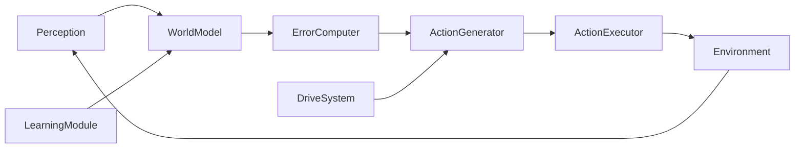

# Repository Guidelines

## Project Overview

Folunar_ is an autonomous AI agent research project. Phase 1-8 tested **PEDA** (Predictive-Error-Driven Autonomous Agent): the hypothesis that prediction error from an LLM-based World Model can drive epistemic exploration. Phase 9 explores three post-PEDA directions.

**Status: PEDA DISPROVEN** (19 experiments, 3 charter sub-questions all No). See `PEDA_FINAL/PEDA_CONCLUSION.md`. The reliable mechanism is **count-based novelty** (62.2% on 9 sandbox tasks, zero task knowledge). See `PEDA_FINAL/COUNT_DRIVEN_CHARTER.md`.

**Current phase: Phase 9** — three new research directions under design:
1. LLM-as-Hypothesis-Generator + Lightweight Discriminator
2. Hierarchical Horizon Decomposition (epistemic goal selection at horizon 20-100)
3. Counter-Intuitive Sandbox (LLM prior-violation environment)

This document is a living guide for AI assistants. It inherits the global `AGENTS.md` in `~/.omp/agent/AGENTS.md`. Project Overrides below take precedence when they conflict.

## Project Overrides (Priority Over Global Rules)

- **Subagent 调用**: 推荐使用 subagent 分担工作，但在调用前需向用户提问确认是否同意。用户同意后方可用 `task` 工具分发。
- **编排优先**: 主要做分析、设计合约、分解任务。确认用户同意分发后，再拆为独立切片交付 subagent。
- **Before destructive actions** (deleting files, rewriting history, force-pushing, changing core data formats), ask the user. Routine code edits and tests do not need explicit permission.
- **Git dual-tree:** frequent small commits and pushes on both `dev` and `main`. Milestone work squash-merged to `main`. Never force-push.
- **编排优先**: 主要做分析、设计合约、分解任务。用户要求分发时才用 subagent 执行。

## Architecture & Data Flow

PEDA is a closed loop of seven modules. The driving signal is **prediction error**, not a user prompt.



| Module | Core responsibility | Key output |
|---|---|---|
| **Perception** | Convert raw environment signals into a structured `State` | `State` object |
| **World Model** | Predict how key state variables change after an action | `PredictedState` (3 levels) |
| **Predictive Error Computer** | Quantify prediction error and split it into epistemic / aleatoric parts | `ErrorVector` |
| **Action Generator** | Roll out candidates and pick the one with lowest Expected Free Energy (EFE) | `Selected_Action` |
| **Action Executor** | Run the action in the sandbox | `Execution_Result` |
| **Learning Module** | Buffer transitions, batch-update the World Model with LoRA, detect saturation | `Model_Update` |
| **Homeostatic Drive System** | Dynamically balance four drives that modulate action selection | `DriveWeights` |

**Three-level prediction** (do not predict full state):
1. **L1** — exit code (target ≥ 90%).
2. **L2** — filesystem delta (target ≥ 70%).
3. **L3** — output summary (best-effort ≥ 50%).

Things explicitly **not** predicted: timestamps, PIDs, random numbers. These are tagged `ALEATORIC`.


> **Note:** These principles were specific to the PEDA paradigm (now DISPROVEN). Phase 9 directions are not bound by them. Retained for historical context.
## Four Immutable Principles

1. **No Prompt, only Prediction Error.** Never add features that require user input to trigger behavior.
2. **Drive is emergent, not hardcoded.** Never write fixed goal lists or fixed drive weights.
3. **World Model is the core.** Spend ~80% of effort on the World Model; any new module must directly improve its predictions.
4. **Learning is intermittent, not continuous.** Collect data, then batch-update. Never do per-step online SGD.
## Key Directories

| Directory | Purpose |
|---|---|
| `PEDA_FINAL/` | Core authority docs + `paper/` (manuscript + evidence bundles 248KB) + `archive/` (phase1-7). |
| `PEDA_FINAL/paper/` | Final manuscript (720 lines), 11 evidence bundles, claims-vs-evidence cross-reference. |
| `src/phase1/` | Phase 1 Grid World: `types.py`, `grid_env.py`, `world_model.py`, `drive_system.py`, `run.py`. |
| `src/phase2/` | Phase 2 Sandbox: `sandbox_env.py` (Docker + SandboxState + candidate generator). |
| `src/phase5/` | Phase 5 JEPA + Action Model: `jepa_wm.py`, `action_model.py`, `explorer.py`. |
| `src/phase6/` | Phase 6 Grid Maze: `grid_env.py`, `maze_generator.py`, `stochastic_maze.py`. |
| `src/phase7/` | Phase 7 GPU tracks: `rssm_wm.py`, `giant_maze.py`, `goal_jepa.py`, `curriculum_explorer.py`. |
| `src/phase8/` | Phase 8 Count-Driven Agent: `count_driven_agent.py` (62.2% on 9 tasks). |
| `src/phase9/` | Phase 9 Post-PEDA (pending): hypothesis-generator + hierarchical-horizon + counter-intuitive sandbox. |
| `scripts/` | Per-phase experiment scripts (phase2_* through phase8_*). |
| `tests/phase1/` | Phase 1 pytest suite (138 stub tests). |
| `results/` | Evaluation reports, training data (JSONL), GPU run results. |
| `checkpoints/` | LoRA adapters (phase1, phase2). |
| `checkpoints/phase1/` | Phase 1 LoRA adapters + stub markers. |
| `checkpoints/phase2/` | Phase 2 sandbox adapters: `sandbox_adapter_e1/e2/e3/`, `sandbox_adapter_v2_e1/`. |

## Development Commands

```bash
# Activate venv
source venv/bin/activate

# Phase 1 tests (stub mode)
PYTHONPATH=src FOLUNAR_STUB_MODEL=1 python -m pytest tests/phase1 -q

# Phase 2: collect data (random baseline, all tasks, v1 sandbox)
python scripts/phase2_collect_data.py --baseline random --all-tasks --num-episodes 5

# Phase 2: collect data (PEDA, specific task, with adapter)
python scripts/phase2_collect_data.py --baseline peda --task read_note \
  --adapter-path checkpoints/phase2/sandbox_adapter_e2 --max-steps 10

# Phase 2: train adapter
python scripts/phase2_synthetic_train.py \
  --data results/phase2_train_merged.jsonl \
  --output-dir checkpoints/phase2/sandbox_adapter_e1 --epochs 3 --batch-size 4

# Phase 2: generate expert demos
python scripts/phase2_expert_demos.py

# Phase 2: v2 sandbox (enriched, with Docker image peda-sandbox:v2)
docker build -f Dockerfile.busybox_v2 -t peda-sandbox:v2 .

# Lint
ruff check src tests
```

## Current Verification Status

### Phase 1-2 (Grid World + Sandbox foundation)
- Phase 1: Stub mode 138 tests. Real-LLM: G1=1.000, G2=0.434, G3=0.000 — memorization, not generalization.
- Phase 2: Formal targets met. L1=1.000, L2=0.900, L3=0.550 held-out. 10,040 transitions. PEDA 20/20 1-step completions.
- Pattern identified: action-visibility + task reward, not epistemic exploration.

### Phase 3-5 (JEPA + Action Model)
- Phase 3 N=20: 80/80 episodes marked success but only 14/80 real fht pass. success=scr>0 tautology discovered.
- Phase 4 closed-loop: Success curve 20%→80% reported but per-episode JSONL LOST (tmux recovery only).
- Phase 5 JEPA: 11 sub-configs (E13.01-E13.11, 7 recoverable), 0/5 tracks with epistemic signal. JEPA never beat count in any experiment. DLR 0.8-0.9 throughout.
- STRIPS ActionModelLearner: 45.8% learned vs 31.3% fallback — mild signal.

### Phase 6-7 (Maze scaling + GPU)
- Phase 6 Grid Maze: 5x5 (100 cells) and 10x10 stochastic (400 cells). JEPA = 0% vs count = 100% on stochastic. Hybrid 67%: count-driven carries JEPA, zero additive value.
- Phase 7 GPU 5-track (E17.1-E17.5): 3 tracks no result files (Goal-JEPA, Curriculum, Random-Maze). RSSM single-model no signal.
- 20x20 (8400 states): BOTH count and JEPA at 0% — counting fails at scale, JEPA fails equally at scale.

### Phase 8 (Count-Driven Agent)
- Baseline: 28/45 (62.2%) across 9 sandbox tasks, zero task knowledge.
- **2026-08-02 quick wins: 39/45 (86.7%)** — verb×file candidate matrix + cached-child revisit + budget guard (`results/phase8_qw_report.md`, commit bdc1f68).
- Direct-read tasks: 100%. Deep-path tasks: read_note 3/5, find_api_key 2/5, find_errors_v4 5/5.
- count_lines: 0% → 80% (wc -l never hit correct file → verb×file matrix fix).
- Proof: count-based novelty is the reliable mechanism in <1000 state spaces.

### Phase 9 (Post-PEDA Directions — verdicts emerging)
- Direction 1 CI Sandbox: **COMPLETE** — M0/M1/M2 PASS; M4 FAIL (online/batch mismatch); **FF-CI-6 PASS: PE 0.400 ≥ count 0.367 (+3.3pp), failure hypothesis rejected (weak positive, non-inferiority)**. First agent-level PE signal. See `PEDA_FINAL/phase9/CI_M3M4_REPORT.md` §7.
- Direction 2 Hierarchical Horizon: **ALIVE（增益域收窄）** — open-loop 简化后沙盒 41/45、deep-path 7/10；但 FF-GEN-1 泛化判别（v5 depth 2-3 新任务集）：SBH 8/40 vs flat 7/40 弱 PASS（非劣），dist≥2 全臂 0/30。HH 增益限 dist-1 frontier 导航；真深度树需多层规划。λ 维度跨全部实验零分叉，判死。FF-CEIL-1：预算墙次要（SBH s20 deep 3/30）、机制墙主导。FF-MLP-1 路径级规划器 KILL：机械到达 dist-2×38 但 0 成功——瓶颈是方向信息（未知目录选择=字典序赌博），非预算非可达性。λ 在路径规划下首次分叉（λ0 深导航 vs λ05 全浅）。FF-PEC-1（PE 罗盘，研究线收官）：s10 deep 0→3/30、NULL 带如实记录——方向信号真实存在但强度不足（不确定≠有价值）；零任务知识深度树效果边界 ≈10-13% vs 盲选 0%。研究线闭环。See `results/phase9_sbh_r1_report.md` + `results/phase9_gen_report.md` + `results/phase9_ceil_report.md` + `results/phase9_mlp_report.md` + `results/phase9_pec_report.md`.
- Direction 3 Hypothesis-Generator: **DEAD 二次确认** — FF-HG-5 根因修复（verb 先验反转）使 held-out 0→65% 但 aggregate 仍 < count（对称失败）。See `results/phase9_hg_f5_report.md` + `results/phase9_hg_f5_rerun_report.md`.
- Gate verdicts recorded in `PEDA_FINAL/phase9/PHASE9_PLAN.md` §Gate Verdicts (2026-08-02).

### Core Hypothesis Verdict
> All three charter sub-questions answer **No** under tested conditions.
> LLM World Model prediction error is NOT a viable intrinsic drive signal.
> Validated negative result. See `PEDA_FINAL/paper/PEDA_FINAL_MANUSCRIPT.md` (720 lines, 11 evidence bundles).

### Phase 1 gap recap (from `PEDA_FINAL/archive/phase1/phase1_gap_report.md`)
> *"Phase 1 formal targets were met. Phase 1 did not validate the core hypothesis. This gap was correctly identified, but the phase was still archived and advancement occurred without a validated mechanism."*

## Important Files

| File | Purpose |
|---|---|
| `PEDA_FINAL/PEDA_CONCLUSION.md` | Definitive verdict: all 3 charter Q answer No, 19 experiments, errata banner. |
| `PEDA_FINAL/COUNT_DRIVEN_CHARTER.md` | New direction: count-based novelty as primary mechanism. |
| `PEDA_FINAL/paper/PEDA_FINAL_MANUSCRIPT.md` | 720-line negative-result paper (11 evidence bundles, 55 audited claims). |
| `PEDA_FINAL/paper/CLAIMS_VS_EVIDENCE.md` | Canonical 55-claim cross-reference. |
| `PEDA_FINAL/RESEARCH_CHARTER.md` | Original PEDA charter (core question, negative-result acceptance). |
| `PEDA_FINAL/README_FOR_AGENTS.md` | Entry point and file index. |
| `PEDA_FINAL/peda_reflection_v11.md` | v1.0 post-mortem, anti-pattern checklist. |
| `WATCHDOG.md` | 278-line paper validator (3-stage: Data→Writing→Review). |
| `PEDA_WORKING_LOG.md` | Append-only work log.

## Code Conventions

- **Language:** Python 3.10+ with type hints. `dataclasses` for structured data.
- **Model code:** PyTorch + HuggingFace `transformers` + `peft` (LoRA). Keep base model frozen; update only LoRA adapters.
- **Batch learning:** accumulate transitions, batch-update. Save multiple checkpoints for ensemble uncertainty.
- **Uncertainty:** epistemic = variance across ensemble checkpoints; aleatoric = mean prediction error on repeated observations.
- **Safety:** every command passes regex blacklist/whitelist, Docker capability drops, read-only rootfs, no network.
- **Anti-patterns:** <1M parameter models, template-only action spaces, neuroscience labels on trivial classes, plan-document inflation, dishonest metrics.

## Agent Collaboration Rules

- **Subagents: 积极调用。** 主要工作通过 subagent 完成。主模型只做编排——分析需求、设计合约、拆解任务、审核结果。
- **调用流程**：分析范围 → 写合约（`local://` 文件，含 Target/Change/Acceptance）→ 分发给 subagent → 等待完成 → 检查交付物 → 合并报告。
- **Main agent:** owns architecture decisions, cross-file synthesis, contract design, and final verification. Does NOT write code or run long experiments directly.
- **Coordination:** if multiple subagents touch the same file, use IRC to coordinate before editing.
- **Verify before yielding:** run the specific test or scenario that exercises your change; do not rely on "it compiles" or lint-only checks.
