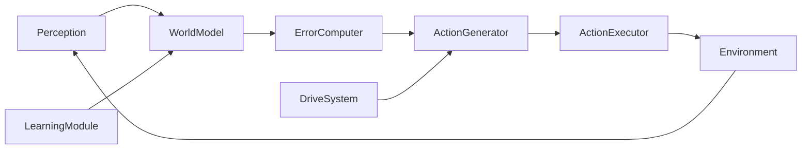

# Repository Guidelines

## Project Overview

Folunar_ is a greenfield redesign of an autonomous AI agent around **PEDA** (Predictive-Error-Driven Autonomous Agent). The core mechanism: a World Model predicts action consequences, prediction errors drive exploration, intermittent learning closes the loop.

**Current phase: Phase 2** — busybox Linux sandbox with LoRA-based World Model (Qwen2.5-0.5B-Instruct), 5 original + 5 new micro-tasks, Docker containment.

**Phase 2 formal targets met**: L1/L2/L3 held-out thresholds passed (1.000/0.900/0.550), 10,040 transitions collected, PEDA completes 20/20 episodes across 4 tasks. **Core hypothesis (prediction-error-driven exploration) not yet validated** — this is the current P0.

This document is a living guide for AI assistants. It inherits the global `AGENTS.md` in `~/.omp/agent/AGENTS.md`. Project Overrides below take precedence when they conflict.

## Project Overrides (Priority Over Global Rules)

- **Subagent 调用**: 推荐使用 subagent 分担工作，但在调用前需向用户提问确认是否同意。用户同意后方可用 `task` 工具分发。
- **编排优先**: 主要做分析、设计合约、分解任务。确认用户同意分发后，再拆为独立切片交付 subagent。
- **Before destructive actions** (deleting files, rewriting history, force-pushing, changing core data formats), ask the user. Routine code edits and tests do not need explicit permission.
- **Git dual-tree:** frequent small commits and pushes on both `dev` and `main`. Milestone work squash-merged to `main`. Never force-push.
- **编排优先**: 主要做分析、设计合约、分解任务。用户要求分发时才用 subagent 执行。

## Architecture & Data Flow

PEDA is a closed loop of seven modules. The driving signal is **prediction error**, not a user prompt.



| Module | Core responsibility | Key output |
|---|---|---|
| **Perception** | Convert raw environment signals into a structured `State` | `State` object |
| **World Model** | Predict how key state variables change after an action | `PredictedState` (3 levels) |
| **Predictive Error Computer** | Quantify prediction error and split it into epistemic / aleatoric parts | `ErrorVector` |
| **Action Generator** | Roll out candidates and pick the one with lowest Expected Free Energy (EFE) | `Selected_Action` |
| **Action Executor** | Run the action in the sandbox | `Execution_Result` |
| **Learning Module** | Buffer transitions, batch-update the World Model with LoRA, detect saturation | `Model_Update` |
| **Homeostatic Drive System** | Dynamically balance four drives that modulate action selection | `DriveWeights` |

**Three-level prediction** (do not predict full state):
1. **L1** — exit code (target ≥ 90%).
2. **L2** — filesystem delta (target ≥ 70%).
3. **L3** — output summary (best-effort ≥ 50%).

Things explicitly **not** predicted: timestamps, PIDs, random numbers. These are tagged `ALEATORIC`.

## Four Immutable Principles

1. **No Prompt, only Prediction Error.** Never add features that require user input to trigger behavior.
2. **Drive is emergent, not hardcoded.** Never write fixed goal lists or fixed drive weights.
3. **World Model is the core.** Spend ~80% of effort on the World Model; any new module must directly improve its predictions.
4. **Learning is intermittent, not continuous.** Collect data, then batch-update. Never do per-step online SGD.

## Key Directories

| Directory | Purpose |
|---|---|
| `PEDA_FINAL/` | Core authority docs (6 files at root) + `archive/` (phase1/1_5/2/historical). |
| `src/phase1/` | Phase 1 Grid World: `types.py`, `grid_env.py`, `world_model.py`, `drive_system.py`, `run.py`. |
| `src/phase2/` | Phase 2 Sandbox: `sandbox_env.py` (Docker + SandboxState + candidate generator). |
| `scripts/` | Phase 1 + 2: `phase2_collect_data.py`, `phase2_synthetic_train.py`, `phase2_expert_demos.py`. |
| `tests/phase1/` | Phase 1 pytest suite (138 stub tests). |
| `config/` | Generated configs. |
| `results/` | Evaluation reports, training data (JSONL). |
| `checkpoints/phase1/` | Phase 1 LoRA adapters + stub markers. |
| `checkpoints/phase2/` | Phase 2 sandbox adapters: `sandbox_adapter_e1/e2/e3/`, `sandbox_adapter_v2_e1/`. |

## Development Commands

```bash
# Activate venv
source venv/bin/activate

# Phase 1 tests (stub mode)
PYTHONPATH=src FOLUNAR_STUB_MODEL=1 python -m pytest tests/phase1 -q

# Phase 2: collect data (random baseline, all tasks, v1 sandbox)
python scripts/phase2_collect_data.py --baseline random --all-tasks --num-episodes 5

# Phase 2: collect data (PEDA, specific task, with adapter)
python scripts/phase2_collect_data.py --baseline peda --task read_note \
  --adapter-path checkpoints/phase2/sandbox_adapter_e2 --max-steps 10

# Phase 2: train adapter
python scripts/phase2_synthetic_train.py \
  --data results/phase2_train_merged.jsonl \
  --output-dir checkpoints/phase2/sandbox_adapter_e1 --epochs 3 --batch-size 4

# Phase 2: generate expert demos
python scripts/phase2_expert_demos.py

# Phase 2: v2 sandbox (enriched, with Docker image peda-sandbox:v2)
docker build -f Dockerfile.busybox_v2 -t peda-sandbox:v2 .

# Lint
ruff check src tests
```

## Current Verification Status

### Phase 1 (Grid World)
- Stub mode: 138 tests passing.
- Real-LLM (in-distribution): G1=1.000, G2=0.434, G3=0.000 — memorization, not generalization.
- **Core hypothesis not validated**: environment too simple for epistemic signal.

### Phase 2 (Sandbox)
- Formal targets (v1.1 §4.4): **all met**.
  - Phase 2a: 10,040 transitions [OK].
  - Phase 2b: L1=1.000, L2=0.900, L3=0.550 held-out [OK].
- PEDA multi-task: 20/20 1-step completions (read_note, count_lines, read_hello, find_secret).
- **Core hypothesis still open**: current behavior is action-visibility + task reward, not epistemic exploration.
- Best adapter: `checkpoints/phase2/sandbox_adapter_e2` (200 curated transitions, CPU-trained).
- v2 sandbox: 7 directories, 14 files, 65 unique (state,action) pairs — 3.0× v1.
- v2 adapter: `checkpoints/phase2/sandbox_adapter_v2_e1` (65 transitions, systematic enumeration).
- **Active**: partial-training epistemic vs pragmatic experiment (Slice 1-4).

### Phase 1 gap recap (from `PEDA_FINAL/archive/phase1/phase1_gap_report.md`)
> *"Phase 1 formal targets were met. Phase 1 did not validate the core hypothesis. This gap was correctly identified, but the phase was still archived and advancement occurred without a validated mechanism."*

## Important Files

| File | Purpose |
|---|---|
| `PEDA_FINAL/README_FOR_AGENTS.md` | Entry point and file index (updated with archive structure). |
| `PEDA_FINAL/RESEARCH_CHARTER.md` | Research charter: core question, negative-result acceptance, success definition. |
| `PEDA_FINAL/peda_report_v11.agent.final.md` | Authoritative architecture + implementation plan (2055 lines). |
| `PEDA_FINAL/peda_reflection_v11.md` | v1.0 post-mortem, anti-pattern checklist. Read first. |
| `PEDA_FINAL/peda_independent_review.md` | Third-party review (5.5/10). |
| `PEDA_FINAL/archive/phase1/phase1_gap_report.md` | Phase 1 core hypothesis gap audit. |
| `PEDA_FINAL/archive/phase2/CONTROLLER_DIRECTIVE_PHASE2.md` | Phase 2 controller directive (P0 task, success criteria). |
| `PEDA_WORKING_LOG.md` | Append-only work log. All completed work documented here. |

## Code Conventions

- **Language:** Python 3.10+ with type hints. `dataclasses` for structured data.
- **Model code:** PyTorch + HuggingFace `transformers` + `peft` (LoRA). Keep base model frozen; update only LoRA adapters.
- **Batch learning:** accumulate transitions, batch-update. Save multiple checkpoints for ensemble uncertainty.
- **Uncertainty:** epistemic = variance across ensemble checkpoints; aleatoric = mean prediction error on repeated observations.
- **Safety:** every command passes regex blacklist/whitelist, Docker capability drops, read-only rootfs, no network.
- **Anti-patterns:** <1M parameter models, template-only action spaces, neuroscience labels on trivial classes, plan-document inflation, dishonest metrics.

## Agent Collaboration Rules

- **Subagents: 积极调用。** 主要工作通过 subagent 完成。主模型只做编排——分析需求、设计合约、拆解任务、审核结果。
- **调用流程**：分析范围 → 写合约（`local://` 文件，含 Target/Change/Acceptance）→ 分发给 subagent → 等待完成 → 检查交付物 → 合并报告。
- **Main agent:** owns architecture decisions, cross-file synthesis, contract design, and final verification. Does NOT write code or run long experiments directly.
- **Coordination:** if multiple subagents touch the same file, use IRC to coordinate before editing.
- **Verify before yielding:** run the specific test or scenario that exercises your change; do not rely on "it compiles" or lint-only checks.
