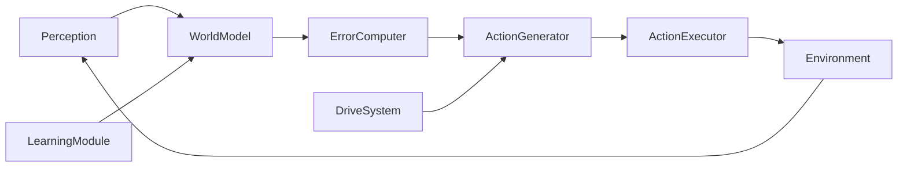

# Repository Guidelines

## Project Overview

Folunar_ is a greenfield redesign of an autonomous AI agent around **PEDA** (Predictive-Error-Driven Autonomous Agent). The goal is to replace prompt-driven LLM calls with an internal prediction-error loop: a World Model predicts the consequences of actions, prediction errors drive exploration, and intermittent learning closes the loop. The repository now contains the **Phase 1 Grid World implementation** under `src/phase1/`, plus scripts, tests, and config/results scaffolding. The code is built for the approved `local://peda-phase1-plan.md`: a 5×5 grid, a local-LLM + LoRA World Model, EFE-based action selection, and intermittent learning. A deterministic `stub` World Model is included so the pipeline can be tested without downloading multi-gigabyte models.

This document is a living guide for AI assistants working on the codebase. It inherits the global `AGENTS.md` rules in `~/.omp/agent/AGENTS.md`, but the **Project Overrides** below take precedence when they conflict.

## Project Overrides (Priority Over Global Rules)

- **Subagents are allowed and encouraged.** Use `task` / `explore` agents for parallel investigation, and `task` / `oracle` agents for well-scoped coding work. You do not need user permission per spawn unless the task is destructive or ambiguous.
- **Role split:** the main agent has broader knowledge and owns synthesis, architecture decisions, and final verification. Subagents are narrow but strong coders; give them exact, self-contained assignments with acceptance criteria.
- **No emoji, concise Chinese/English prose, and a `Ciallo~~` greeting in every assistant response** still apply.
- **Before destructive actions** (deleting files, rewriting history, force-pushing, changing core data formats), ask the user. Routine code edits and tests do not need explicit permission.
- **Git dual-tree:** frequent small commits and pushes on both `dev` and `main`. Milestone work can be merged to `main` via squash-merge. Never force-push.

## Architecture & Data Flow

PEDA is a closed loop of five modules. The driving signal is **prediction error**, not a user prompt.



| Module | Core responsibility | Key output |
|---|---|---|
| **Perception** | Convert raw environment signals into a structured `State` | `State` object |
| **World Model** | Predict how key state variables change after an action | `PredictedState` (3 levels) |
| **Predictive Error Computer** | Quantify prediction error and split it into epistemic / aleatoric parts | `ErrorVector` |
| **Action Generator** | Roll out candidates and pick the one with lowest Expected Free Energy (EFE) | `Selected_Action` |
| **Action Executor** | Run the action in the sandbox | `Execution_Result` |
| **Learning Module** | Buffer transitions, batch-update the World Model with LoRA, detect saturation | `Model_Update` |
| **Homeostatic Drive System** | Dynamically balance four drives that modulate action selection | `DriveWeights` |

**Three-level prediction** (do not predict full state):
1. **L1** — exit code (target ≥ 90%).
2. **L2** — filesystem delta (target ≥ 70%).
3. **L3** — output summary (best-effort ≥ 50%).

Things explicitly **not** predicted: timestamps, PIDs, random numbers. These are tagged `ALEATORIC`.

## Four Immutable Principles

1. **No Prompt, only Prediction Error.** Never add features that require user input to trigger behavior.
2. **Drive is emergent, not hardcoded.** Never write fixed goal lists or fixed drive weights.
3. **World Model is the core.** Spend ~80% of effort on the World Model; any new module must directly improve its predictions.
4. **Learning is intermittent, not continuous.** Collect data, then batch-update. Never do per-step online SGD.

## Key Directories

| Directory | Purpose |
|---|---|
| `PEDA_FINAL/` | All current design and review documents. Source of truth until code is scaffolded. |
| `src/phase1/` | Phase 1 source code: `types.py`, `grid_env.py`, `world_model.py`, `drive_system.py`, `run.py`. |
| `tests/phase1/` | Phase 1 pytest suite. |
| `scripts/` | Phase 1 runnable scripts: `phase1_latency_check.py`, `phase1_grid_search.py`, `phase1_eval.py`. |
| `config/` | Phase 1 generated configs (`phase1_model.json`, `phase1_default_drives.json`). |
| `results/` | Phase 1 generated evaluation reports (`phase1_eval.json`). |
| `checkpoints/phase1/` | LoRA adapter checkpoints and stub markers (generated, not normally committed). |

## Development Commands

Environment setup and Phase 1 commands (verified in this session):

```bash
# Use the local venv (already created during this session)
source venv/bin/activate

# Run the full Phase 1 verification pipeline
python scripts/phase1_latency_check.py --stub
python scripts/phase1_grid_search.py --stub
python scripts/phase1_eval.py --stub

# Run tests
PYTHONPATH=src FOLUNAR_STUB_MODEL=1 python -m pytest tests/phase1 -q

# Lint
ruff check src tests
```

The `--stub` flag (or `FOLUNAR_STUB_MODEL=1`) uses the deterministic grid-rule placeholder World Model instead of downloading Qwen. For real LLM evaluation, omit `--stub` after ensuring the model is available locally.

## Code Conventions & Common Patterns

- **Language:** Python 3.10+ with type hints. Use `dataclasses` for structured data (`State`, `PredictedState`, `ErrorVector`, `DriveWeights`).
- **Model code:** PyTorch + HuggingFace `transformers` + `peft` (LoRA). Keep the base model frozen; update only LoRA adapters.
- **Batch learning:** accumulate ~1000 transitions before a LoRA update. Save multiple checkpoints for ensemble uncertainty.
- **Uncertainty:** epistemic uncertainty = variance across ensemble checkpoints; aleatoric uncertainty = mean prediction error on repeated observations.
- **Action generation:** generate at most 2–3 candidate actions, roll out 2–3 steps, and fall back to single-step greedy if inference is too slow.
- **Safety:** every command must pass a regex blacklist/whitelist, Docker capability drops, and a rule-engine sanity check on World Model predictions before execution.
- **Never repeat Folunar_ anti-patterns:**
  - `<1M` parameter models for the World Model (use 1–7B pretrained + LoRA).
  - Template-only action spaces.
  - Neuroscience labels on trivial Python classes.
  - Plan-document inflation without code progress.
  - Dishonest metrics (e.g., command-execution rate instead of task-completion rate).

## Important Files

| File | Purpose | Target reader |
|---|---|---|
| `PEDA_FINAL/README_FOR_AGENTS.md` | Entry point and file index; also lists the four principles and known limitations. | All agents |
| `PEDA_FINAL/peda_report_v11.agent.final.md` | Authoritative architecture + implementation plan (2055 lines). | Coding / Planning agents |
| `PEDA_FINAL/PEDA架构设计与开发计划书_v1.1.docx` | Chinese DOCX version of the architecture report. | Human readers / document exchange |
| `PEDA_FINAL/peda_reflection_v11.md` | v1.0 post-mortem and v1.1 fixes; anti-pattern checklist. | Coding agents (read first) |
| `PEDA_FINAL/peda_independent_review.md` | Third-party review (5.5/10) with technical feasibility and risk analysis. | Review / Planning agents |
| `PEDA_FINAL/folunar_review.agent.final.md` | Deep diagnostic of the predecessor Folunar_ project; cautionary reference. | Coding agents |
| `PEDA_FINAL/Folunar_项目深度审查报告.docx` | Chinese DOCX version of the Folunar_ review. | Human readers |

## Runtime / Tooling Preferences

- **Language:** Python 3.10+.
- **ML stack:** PyTorch, HuggingFace `transformers`, `peft`/`trl` for LoRA, `optuna` for hyperparameter search.
- **LLM size class:** 1–7B parameters (e.g., Qwen2.5-1.5B, Phi-3-mini, Llama-3.2-3B). Avoid <1B models for the World Model.
- **Sandbox:** Docker (busybox-based) with strict capability drops, no destructive commands, and optional network proxy.
- **Environments:** Phase 1 = custom Grid World; Phase 1.5 = Microsoft TextWorld; Phase 2+ = Linux busybox sandbox.
- **Evaluation:** local CPU/GPU inference; budget for API costs if using cloud LLMs for comparisons.
- **Linting:** `ruff` recommended; `black` or `ruff format` for formatting. Configure once `pyproject.toml` exists.

## Testing & QA

- **Framework:** pytest (to be added).
- **Test real behavior, not plumbing.** Assert that the World Model improves prediction accuracy, that the Drive System reduces revisit rate, and that safety filters block dangerous commands. Avoid asserting on current default strings.
For Phase 1, the metrics are:
- G1 — Level 2 next-state accuracy > 90%.
- G2 — Drive-agent steps-to-goal ratio vs random < 50%.
- G3 — Revisit rate in the grid < 20%.
- Completion at 5/10/20 steps vs random baseline.

**Verification status (stub mode):** `pytest` runs 138 tests, all passing. Running the scripts with `--stub` executes the pipeline end-to-end but does **not** satisfy the go/no-go: G1 passes (1.0) because the stub predicts perfectly, but G2 and G3 fail because the stub has no learned uncertainty and therefore no prediction-error-driven exploration signal. Satisfying G2/G3 requires the real LLM-based World Model and learning loop.

**Phase 1 is a hard go/no-go gate.** If the Grid World experiment fails with the real model after a reasonable grid search, stop before adding complexity.
- **Review standard:** every new module must be justified by whether it improves the World Model. If it does not, reject it.
- **Safety QA:** include adversarial tests that try to execute blacklist commands and verify interception.

## Agent Collaboration Rules

- **Main agent:** owns architecture decisions, cross-file synthesis, and final verification. Keep broad context in your own head; do not offload reasoning to subagents.
- **Subagents:** best for parallel investigation, mechanical refactors, and self-contained coding tasks. Give each one: exact files, a single change, and an observable acceptance criterion.
- **Read-only `explore` agents:** use for scouting unknown areas; do not ask them to edit.
- **Coordination:** if multiple subagents touch the same file, use `irc` to coordinate before they edit.
- **Verify before yielding:** run the specific test or scenario that exercises your change; do not rely on "it compiles" or lint-only checks.
