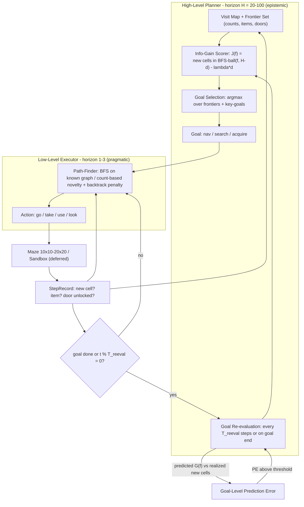

# Plan: Hierarchical Horizon Decomposition

**Status:** Design (First Deliverable of `contract-hierarchical-horizon.md`)
**Author:** HierarchicalHorizonDesign (subagent)
**Date:** 2026-07-31

---

## 0. Thesis — why the hierarchy is (claimed to be) necessary

Flat agents (EFE at horizon 1-3, count-based novelty) evaluate epistemic value as a
**per-step quantity** `v(s,a) = novelty(s,a) ≈ 1/√(1+c)` where `c` is the visit count.
At an exhausted cell `c → ∞` so `v ≈ 0`, but the *next interesting cell* is `d ≥ 2` steps
away. A horizon-1 selector only sees `v(s₀, a)` — the local term — so it cannot see that
committing to a frontier 8 steps away yields 15 new states. **Epistemic value is a sum over
a horizon:**

```
V_epistemic(goal) = Σ_{t=1..H} v(s_t | commit to goal)     — the "delayed reward"
```

The hierarchy exists to compute this sum **analytically** (high level, horizon H = 20–100)
instead of sampling it with a short-horizon model (low level, horizon 1–3, which provably
misses every term with `t > 1`). That is the entire claim to test:

> **H1:** a planner that scores goals by *expected new states within its horizon* discovers
> more of the environment per step than (a) flat count-based novelty and (b) the same
> executor with *randomly chosen* goals.

If H1 fails, the direction is dead (see §7).

**Why size matters (the motivation for this direction):** the count-based baseline is
*already optimal at small scale*. Phase 6 on Grid Maze 10x10 (~1100 states) reached 100%
goal-reaching; at 20x20 (~8400 states) both count and JEPA collapse to 0% — "both agents
hit state-space ceiling" (PEDA_CONCLUSION.md, Experimental Evidence rows 6). The hierarchy's
payoff should *grow with state-space size*: long-horizon goal commitment matters exactly
where local novelty saturates and random wandering drowns. Consequently the decisive test
of H1 is the LARGE maze, not the small one — on 10x10 every condition may sit at ceiling
and "beats count" would be unfalsifiable (§7).

---

## 1. Architecture



**Data flow contract (honest loop):** the planner NEVER introspects the environment. It only
knows what the executor reports in `StepRecord`s. The executor never decides *where* to go —
only *how* to get there.

---

## 2. High-Level Epistemic Goal Selection (concrete algorithm)

### 2.1 Planner state

```
PlannerState:
  graph      : known passable graph (cells + edges)          # maze: from maze.is_passable
  visits     : cell -> int                                   # visit count (content seen)
  items      : cell -> [item]                                # observed item locations
  inventory  : [item]
  locked     : { door_edge -> key_name }                     # edges blocked until unlocked
  unlocked   : set[door_edge]
  pos        : current cell
```

**Knowledge protocol (Validation Protocol A):** geometry (walls/doors) is known; **cell
contents (items, goal, keys) are hidden until visited**. This isolates the *planning*
question from the *perception* question and makes the estimator exact (see §6 for why this
is the right first protocol).

### 2.2 Goal space

Two goal kinds, both generated from planner state — no learned model, no LLM needed:

1. **Frontier goals.** `frontiers = { f : visits[f] > 0 and ∃ neighbor n of f with visits[n] == 0 }`.
   Lemma (frontiers suffice): every path to any unvisited cell passes through a frontier, so
   committing to the frontier with the best reachable-info ball dominates committing to any
   deeper cell — the deeper cell's info is a subset of the frontier's ball.
2. **Key goals** (only when locked doors exist): for each locked `door_edge` with `key_name`,
   if the door is still locked, propose `Goal(kind="search", item=key_name, door_edge=...)`.

### 2.3 Scoring — the exact info-gain estimator

For a frontier goal `f`, with `d = BFS_dist(pos, f)` on the passable graph (locked edges
excluded unless unlocked):

```
budget(f) = H_plan − d                     # steps left after travel, within planner horizon
ball(f)   = BFS-reachable set from f within budget(f) steps    # exact on known graph
G(f)      = |{ c ∈ ball(f) : visits[c] == 0 }|                 # expected NEW states
J(f)      = G(f) − λ · d                     # delayed reward minus travel tax
```

- `H_plan` (20–100) is the planner's *epistemic horizon* — the horizon over which the delayed
  reward is summed. This is the single parameter that flat h1-3 cannot have.
- `λ ≥ 0` trades richness against travel cost:
  - `λ = 0` → always the richest region regardless of commute (wastes steps).
  - `λ → ∞` → always the nearest frontier (degenerates toward local greedy ≈ flat count-based).
  - The interesting regime is the interior — the λ sweep IS the H1 measurement (§7 FF2).

For a key goal (door `e`, region behind it `R_lock` computed by BFS on graph-with-door-open):

```
g_unlock = |{ c ∈ R_lock : visits[c] == 0 }|                  # delayed reward: whole region
d_search = known key cell ? BFS_dist(pos, key_cell) + BFS_dist(key_cell, door)
                          : |{ c : reachable and visits[c] == 0 }|   # upper bound (heuristic)
J_key    = g_unlock − λ·(d_search + BFS_dist(pos, door)) − κ·u
           # u = 1 if key location unknown else 0  (uncertainty penalty), κ ≈ 0.5·g_unlock threshold
propose J_key only if g_unlock ≥ 0.1 · |{c : visits[c]==0}|   # don't key-hunt tiny regions
```

The key goal is the purest "delayed reward" case: its value (an entire unexplored region)
materializes only after *find key → travel to door → unlock* — 10+ steps that no h1-3 signal
can see, but the planner computes exactly from the visit map.

### 2.4 Selection

```
select(planner_state, H_plan, λ):
    candidates = frontier_goals ∪ key_goals
    if not candidates: return None                     # fully explored → episode done
    return argmax J over candidates; ties → smaller d (cheaper travel)
```

Deterministic, O(|cells| · |candidates|) per call — microseconds on a 100–400 cell maze.

### 2.5 LLM slot (optional, deferred)

The charter allows "LLM 慢思考" at the high level. Design: an optional `GoalProposer`
interface returns candidate `Goal`s; the geometric proposer (frontiers + key goals) is the
default; an LLM proposer may add *semantic* goals ("check the Treasury"). **All proposals go
through the same algorithmic scorer** — the LLM never sets the score, so fail-fast metrics
are not confounded by LLM variance. Prototype uses geometric only; LLM only after FF1–FF4
pass.

---

## 3. Low-Level Executor Interface

```python
# src/hierarchical/goals.py
Cell = tuple[int, int]

@dataclass(frozen=True)
class Goal:
    kind: Literal["nav", "search", "acquire"]
    target: Cell | None = None            # nav: destination cell; acquire: item's cell
    item: str | None = None               # search/acquire: item name
    door_edge: tuple[Cell, Cell] | None = None   # search: which door the key unlocks

# src/hierarchical/executor.py
class LowLevelExecutor(Protocol):
    """Receives ONE Goal from the planner; returns short pragmatic action sequences."""
    def plan(self, state: GridState, goal: Goal, horizon: int = 3) -> list[str]:
        """Up to `horizon` actions (1-3) toward goal. Re-planned every call (cheap)."""
    def step(self, state: GridState, goal: Goal) -> str:
        """Single action; loop driver calls this each tick: plan(state, goal, 1)[0]."""
    def on_goal_update(self, goal: Goal) -> None:
        """Planner switched goals — drop stale caches (e.g., backtrack penalty state)."""

@dataclass
class StepRecord:
    state_before: GridState
    action: str
    state_after: GridState
    cell_after: Cell
    content_new: bool            # first visit to cell_after (feeds visit map)
    item_acquired: str | None
    door_unlocked: str | None
    goal_reached: bool

# src/hierarchical/planner.py
class HighLevelPlanner:
    def update(self, rec: StepRecord) -> None: ...        # mutate visit map / items / doors
    def propose_goals(self) -> list[Goal]: ...            # §2.2
    def score(self, g: Goal, H_plan: int, lam: float) -> float: ...   # §2.3
    def select(self, H_plan: int, lam: float) -> Goal | None: ...     # §2.4
    def re_evaluate(self, H_plan: int, lam: float, tau: float) -> Goal | None: ...  # §4
```

**Executor implementations (both exist already or are ~30 lines):**

| Goal kind | Executor | Mechanism |
|---|---|---|
| `nav` | `BFSExecutor` | BFS shortest path on known graph → first k `go <dir>` actions |
| `acquire` | `BFSExecutor` | BFS to item cell → `go…` + `take <item>` |
| `search` | `NoveltySearchExecutor` | wraps Phase-6 `MazeNoveltyExplorer` (count-based novelty + backtrack penalty + success cache), horizon 1-3; in the sandbox it is exactly the Phase-8 `NoveltyExplorer` + `generate_sandbox_candidates` |

The low level NEVER sees `J`, `H_plan`, or the visit map — it is a pure pragmatic
path-finder, identical across all experimental conditions (so any difference in outcome is
attributable to goal selection alone).

---

## 4. Goal Re-evaluation Loop

```
loop(state, goal, planner, executor, T_reeval, H_plan, λ, τ):
    for t in 1..max_steps:
        a = executor.step(state, goal)
        next_state = env.step(a);  rec = make_record(...)
        planner.update(rec)
        if rec.goal_reached: break
        goal_done = goal_complete(goal, rec)               # arrived / item found / door opened
        if goal_done or t % T_reeval == 0:
            new_goal = planner.re_evaluate(H_plan, λ, τ)
            if new_goal is not None and new_goal != goal:
                executor.on_goal_update(new_goal);  goal = new_goal
        state = next_state
```

**Switch rule (hysteresis, anti-thrash):** switch iff `J(new) > J(cur) + max(τ·J(cur), 1.0)`
with `τ = 0.15`. A goal also auto-terminates on completion (arrived / key found / door
unlocked) or blockage (BFS to a `nav` goal fails because a locked door is in the way → the
planner escalates to the matching key `search` goal).

**Goal-level prediction error (the PEDA principle, moved to the right granularity):** on
commit, the planner records `G_pred = G(f)`. On re-eval it compares against realized new
cells discovered while committed:

```
PE_goal = |G_pred − realized| / max(G_pred, 1)
```

Log per goal kind. High `PE_goal` means the scoring model is wrong about a region — that is
the measurable "prediction error at the horizon where it is meaningful," and it feeds the
fail-fast diagnosis (§7). If re-evaluation adds nothing (§7 FF3), the loop is dropped and the
planner runs open-loop.

---

## 5. Minimum Validation Environment

**Primary: Grid Maze with a SIZE dimension — 10x10, 15x15, 20x20 (`src/phase6/grid_env.py` +
`maze_generator.py`). Sandbox is deferred to a transfer check (§8).**

Size is not a nicety — it is the *independent variable that makes the question testable*:

| Size | Cells | Est. states* | Count baseline (PEDA_CONCLUSION) | Role |
|---|---|---|---|---|
| 10x10 | 100 | ~1100 | 100% goal-reaching — already optimal | Sanity: layering must not *degrade*; FF1/FF4 void at ceiling |
| 15x15 | 225 | ~2400 | not measured | Intermediate scaling check |
| 20x20 | 400 | ~8400 | 0% — count and JEPA both collapse | **Decisive: only a win here counts as direction alive** |

*per `GridMaze.state_estimate()`; numbers as reported in PEDA_CONCLUSION.md, rows 6.

If every condition ties at 10x10 (ceiling), the 10x10 arms are *non-informative*, not
negative — the alive/dead verdict is made at 20x20 (see §7).

Rationale:

1. **Known graph → exact estimator.** The whole point of the high level is computing the
   delayed-reward sum exactly. The maze gives `is_passable()` for free, so `G(f)` is exact
   and any layering advantage is attributable to *goal selection*, not estimation noise.
   In the sandbox the graph is unknown and the estimator must become a density heuristic —
   that confounds the H1 measurement.
2. **Existing baseline + metrics.** `scripts/phase6_maze_count.py` already ships the count
   baseline (`MazeNoveltyExplorer` with backtrack penalty) and metrics (FHT, SCR,
   dead_loop_rate, 12 episodes, `max_steps = min(size·4, 500)` — 400 at 10x10, 500 at
   20x20). "Beat the baseline" is directly measurable against committed code — and the
   committed data already shows the baseline *collapses* between 10x10 and 20x20, which is
   exactly the regime this design targets.
3. **Delayed-reward structure exists in pure form:** goal choice → reward arrives after
   `d ≥ 2` travel steps; a locked-door variant makes it `d ≈ 10+` (find key → travel →
   unlock → whole region), which is exactly the regime flat h1-3 cannot see.
4. **CPU-only, minutes per sweep.** BFS on a 100–400 cell graph is microseconds; the full
   sweep (3 sizes × 12 episodes × ~25 configs ≈ 900 episodes, ≤500 steps each) runs in
   minutes with no Docker, no GPU.

**Maze variants (run at EVERY size; 20x20 is the decisive arm):**

| Variant | Setup | What it isolates |
|---|---|---|
| A. Plain (no doors) | `GridMaze.generate(size, size, seed)` | Is long-horizon goal choice better than random goals for pure coverage? |
| B. Locked doors (2) | 2 locked doors, keys in far rooms | Is the *delayed* reward (locked region) discoverable by long-horizon scoring? The make-or-break scenario — decisive at 20x20. |

**Note on horizon scaling:** `H_plan ∈ {20, 50, 100}` must be read against maze diameter
(10x10 ≈ 18, 20x20 ≈ 38). A horizon covering 25%+ of the maze flattens `J(f)` (FF2); that
interaction is a finding, not a bug — it is why the `H_plan` grid is swept at every size.

**Required env change (~20 lines, implementation phase):** wire `MazeTask.locked_doors` into
`GridMazeEnv` — the door/key/`use` machinery already exists in the env (`_locked_doors`,
`_handle_use`, `setup()`) but `GridMaze.generate()` never populates it. Add door
construction + key placement to the maze generator and have `setup()` consume
`MazeTask.locked_doors`.

**Sandbox (deferred):** only if maze passes FF1–FF4. Then switch the estimator to the
unknown-graph variant: frontier density `G(f) ≈ |frontier-neighbors of f|` (observed-graph
BFS ball) and reuse Phase-8 `NoveltyExplorer` as the search executor. Sandbox answers
transfer, not existence — the existence question is answered by the maze.

---

## 6. Experiment Protocol (separating "layering helps" from "random + overhead")

**Knowledge protocol:** the planner knows geometry only; contents (items, goal, keys) are
hidden until visited. The experimenter's goal room is hidden from the agent; FHT measures how
quickly pure exploration happens to find it. (Protocol B — fog-of-war walls too — is a
secondary variant; it makes the estimator heuristic and is not needed for fail-fast.)

**Conditions** (all use the same seeds per condition → paired comparison):

| Condition | Planner | Executor |
|---|---|---|
| `flat_count` (existing baseline) | none | `MazeNoveltyExplorer` (Phase-6) |
| `random_goal` | uniform random frontier | `BFSExecutor` + `NoveltySearchExecutor` |
| `layered(λ, H_plan)` | §2 scorer, no re-eval | same executors |
| `layered(λ, H_plan, T_reeval)` | §2 scorer + §4 loop | same executors |

**Parameter grid:** `size ∈ {10x10, 15x15, 20x20}`, `λ ∈ {0, 0.5, 1.0, 2.0, ∞}`,
`H_plan ∈ {20, 50, 100}`, `T_reeval ∈ {never, 10, 25}`.
`max_steps = min(size·4, 500)` (400 at 10x10, 500 at 20x20 — matches the committed
baseline convention). 12 episodes × fixed maze seeds `{42..53}` per size (seed 42 matches
`phase6_maze_count.py`). Full sweep ≈ 3 sizes × 12 episodes × 25 configs ≈ 900 episodes —
minutes of CPU.

**Per-size minimum meaningful effect** (paired, same seeds): `ΔSCR ≥ 0.05` = 5 cells (10x10)
/ 11 cells (15x15) / 20 cells (20x20); `ΔFHT ≥ 20` steps, constant across sizes. ΔSCR of 20
cells on 20x20 is the bar that must clear count's collapse.

**Metrics (per episode, aggregated over 12 seeds; all match Phase-6 definitions):**

- `SCR` — state coverage rate = |cells with content seen| / |cells|. Primary.
- `FHT` — first-hit step of the hidden goal cell. Primary.
- `new_states_per_step` — epistemic efficiency = Δ visited / Δ steps per re-eval interval.
- `dead_loop_rate` — 3× repeated action fraction (Phase-6 definition).
- `PE_goal` — goal-level prediction error (§4), per goal kind.

**Statistical protocol:** paired comparisons on the same seeds (sign test / paired t on
per-seed SCR). **Ceiling guard:** if `flat_count` SCR ≥ 0.95 at a given size (expected at
10x10 — PEDA_CONCLUSION shows 100% goal-reaching there), that size's FF1/FF4 verdicts are
VOID — it cannot discriminate. Verdicts come from sizes below ceiling; 20x20 is the
make-or-break arm.

**Positive bar (direction is alive, proceed to sandbox transfer):** `layered(best λ, H_plan)`
beats `flat_count` on SCR by ≥ 0.05 AND on FHT by ≥ 20 steps at **20x20 Variant B**, and
beats `random_goal` on both metrics at 20x20 (variants A and B). At 10x10 the bar is only
"not worse than `flat_count`" (degradation check) — ties are acceptable at ceiling.

---

## 7. Fail-Fast Conditions (measurable)

| # | Condition | Measure (verdict size in bold) | Failure verdict |
|---|---|---|---|
| FF1 | Goal selection carries signal | `layered(best) vs random_goal`, paired same seeds, **20x20 Variant B (primary), 20x20 Variant A (secondary)**: `ΔSCR < 0.05 AND ΔFHT < 20` | **Direction dead.** Layering = random goals + overhead. Document negative result. |
| FF2 | Scoring formula non-trivial | Coverage range across `λ ∈ {0,…,∞}` `< 0.05` for every `H_plan`, judged at **20x20 and 15x15** (10x10 may be flat for everyone at ceiling) | **Direction dead** (the delayed-reward trade-off does not exist in practice; scoring is noise). |
| FF3 | Re-evaluation loop earns its keep | `layered(·, never) vs layered(·, T_reeval∈{10,25})` at **20x20 Variant B**: `ΔSCR < 0.02` | Loop is dead weight → run planner open-loop; hierarchy survives. |
| FF4 | Layering beats the proven count baseline | `layered(best) vs flat_count` at **20x20 Variant B**: `SCR < baseline + 0.05 AND FHT > baseline + 20` (at any size where `flat_count` SCR ≥ 0.95, this row is void — ceiling) | Hierarchy doesn't earn its complexity → kill or redesign goal space (not just scoring). |

**Kill rules:**

- FF1 **or** FF2 fail **at 20x20** → the hierarchical-horizon direction is dead. Write a
  negative-result note (PEDA-style: charter audit + evidence table) and do NOT scale to the
  sandbox. 10x10 ties do NOT trigger this — only the 20x20 verdicts do.
- FF1/FF2 pass, FF3 fails → simplify (open-loop planner), keep the two-layer split.
- FF1/FF2 pass, FF4 fails → goal space is wrong (e.g., frontiers too local for a 400-cell
  maze); one retry with semantic goals (items/keys) — if still flat, kill.

**Failure modes we are explicitly guarding against** (assumption register):

1. *BFS executor is so good that goal choice doesn't matter* → FF1 catches (random_goal arm).
2. *Uniform maze → all frontiers equally informative* → FF2 catches; variant B (locked doors)
   creates the asymmetry needed for scoring to matter.
3. *Travel tax dominates → planner degenerates to nearest-frontier ≈ flat count* → the
   `λ→∞` arm is the built-in control.
4. *Re-eval thrashes between goals* → hysteresis τ + FF3.

---

## 8. Implementation Roadmap (next deliverable)

```
src/hierarchical/
  __init__.py
  goals.py          # Goal, Cell (immutable goal dataclass)
  planner.py        # HighLevelPlanner: visit map, frontier/key proposals, exact scoring, re-eval
  executor.py       # BFSExecutor, NoveltySearchExecutor, LowLevelExecutor protocol
  loop.py           # run_episode driver (re-eval loop, StepRecord plumbing)
  maze_env_ext.py   # locked-door wiring: GridMaze.generate(doors) + setup(MazeTask.locked_doors)
scripts/phase_hier_experiment.py   # mirrors phase6_maze_count.py conventions; conditions, sweep,
                                   # paired metrics, FF1-FF4 checks, JSONL output to results/
```

Steps:

1. **M1 — harness:** `goals.py` + `executor.py` + `loop.py` + `maze_env_ext.py`; verify
   `random_goal` reproduces `flat_count`-comparable SCR on variant A 10x10 (sanity).
2. **M2 — planner, small sizes:** `planner.py` with exact scoring; FF1/FF2 sweep on variants
   A+B at 10x10 and 15x15. 10x10 serves as the degradation check (must not be worse than
   `flat_count`); 15x15 is the first scaling look.
3. **M3 — decisive size:** full sweep + FF1–FF4 at **20x20, Variant B** (the make-or-break
   arm: count baseline collapses to 0% there). This run alone decides alive vs dead.
4. **M4 — verdict:** fail-fast decision table (§7) + write-up; if alive, sandbox transfer
   design (density estimator + Phase-8 executor) as a follow-up contract.

**Constraints honored:** CPU-only, no GPU; no LLM in the loop for the prototype; beats
count-based, not random, is the bar; reuses Phase-6/Phase-8 components instead of inventing
new ones.
