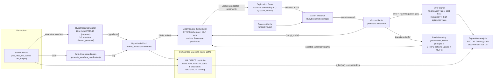

# Plan: LLM-as-Hypothesis-Generator + Lightweight Discriminator

**Status:** Design approved by Main (2026-07-31, 5/5 decisions confirmed)
**Scope:** Engineering exploration, NOT charter-level. If the discriminator error signal shows structure, this scales to a charter-level direction.
**Contract:** `local://contract-hypothesis-generator.md`
**CWD:** `/home/chillizu/Projects/Folunar_/` (code lives in `src/phase9/`, `scripts/phase9_*.py`)

---

## 1. Core Thesis (one paragraph)

PEDA's failure: the LLM World Model (Qwen2.5-0.5B + LoRA) is **too certain** on <1000-state spaces (error ~0 everywhere → zero epistemic signal) or **uniformly wrong** (uncalibrated, confidently incorrect → flat error). The fix this direction tests: **demote the LLM from predictor to proposer**. The LLM only proposes candidate (action, claimed-outcome) hypotheses — it never produces the epistemic signal and is never trained. A **lightweight discriminator** (STRIPS schemas first, symbolic-feature MLP as comparison arm) predicts 5 atomic outcome predicates per (state, action). The exploration signal is **discriminator validation failure**: prediction error of the *discriminator*, which is content-structured (a function of feature-coverage), not LLM error (flat) and not visit-count (flat over unvisited pairs).

### 1.1 Why this is not a known dead end (explicit non-repeat table)

| Dead end (PEDA phases) | Failure mode | This direction's divergence |
|---|---|---|
| LLM direct prediction (P1-P4) | 0.5B+LoRA memorizes <1000 states → error ~0 everywhere; or confidently wrong → uniformly high | LLM is **never the predictor**. Its output is a proposal pool only. Signal comes from the discriminator. |
| Ensemble variance (P1, P5) | Embedding-space variance is flat: all unseen (s,a) equally uncertain | Discriminator uncertainty = **feature/rule coverage** (did we see this verb×ext×precondition combo?), which is a gradient, not a global "unseen" scalar. |
| JEPA forward dynamics (P5-P7) | Predicts next-state embeddings; all unexplored transitions equally uncertain = counting at 37x cost | Discriminator predicts **atomic predicates** (not next state), from **symbolic features** (not embeddings). Error is per-predicate, per-feature-combo. |
| EFE horizon 1-3 (P2-P4) | Pragmatic term dominates epistemic at any testable horizon | No EFE, no pragmatic blend. Selection = discriminator uncertainty + count novelty (the proven baseline stays in the blend). |
| RSSM single model (P7) | No differentiable epistemic signal | Discriminator needs no gradients at inference; STRIPS confidence is exact arithmetic. |
| "WM should not predict file contents" (worklog L1775) | Content prediction uncalibrated and useless | **Nothing predicts file contents.** Predicates are structural facts (exit code, output non-empty, cwd change, listing change, cache gain). Content comes from execution. |

---

## 2. Architecture



Control flow per step (agent loop, post-MVP):
1. Perceive → `SandboxState`.
2. Propose: LLM proposes 3-5 hypotheses + rule-based candidates → dedup → pool.
3. Discriminate: for each candidate, discriminator predicts predicates + uncertainty.
4. Select: `argmax_a [ α · uncertainty_D(s,a) + (1-α) · count_novelty(s,a) ]` (α = 0.5 default).
5. Execute in sandbox → ground-truth predicates.
6. Learn: buffer transition; intermittent batch update of STRIPS schemas + MLP.
7. Signal: discriminator error drives exploration value attribution; success cache replays wins.

The MVP (Section 4) validates steps 1-6 **offline** (no agent loop): probe → discriminate → execute → measure error field.

---

## 3. Module Interfaces

### 3.1 Shared types (`src/phase9/types.py`)

```python
@dataclass
class OutcomePredicates:
    """Atomic outcome facts. NEVER file contents (worklog L1775 lesson)."""
    exit_ok: bool          # exit code == 0
    output_nonempty: bool  # stdout or stderr non-empty
    cwd_changed: bool      # action was `cd` (or otherwise moved cwd)
    listing_changed: bool  # next_state.files != state.files
    cache_gained: bool     # file_cache gained an entry (cat/head/tail/wc hit)

    def to_vector(self) -> tuple[bool, bool, bool, bool, bool]: ...
    @staticmethod
    def from_transition(state: SandboxState, action: str, next_state: SandboxState) -> "OutcomePredicates": ...
    @staticmethod
    def hamming(a: "OutcomePredicates", b: "OutcomePredicates") -> float:
        """0.0 .. 1.0 (fraction of mismatched predicates)."""

@dataclass
class Hypothesis:
    action: str            # whitelisted command string
    claimed_outcome: str   # LLM free text — AUDIT ONLY, never part of the signal
    source: str            # "llm" | "candidates" | "strips"

@dataclass
class Verdict:
    predicates: OutcomePredicates   # discriminator prediction
    confidence: float               # 0..1, per-predicate probability aggregated
    uncertainty: float              # pre-execution exploration value = 1 - confidence
    error: float                    # post-execution: hamming(pred, ground_truth); None before execution

@dataclass
class Transition:
    state: SandboxState
    action: str
    next_state: SandboxState
    ground_truth: OutcomePredicates
    success: bool
```

### 3.2 Hypothesis Generator (`src/phase9/hypothesis_generator.py`)

```python
class HypothesisGenerator(Protocol):
    def propose(self, state: SandboxState) -> list[Hypothesis]: ...

class LLMHypothesisGenerator:
    """MiniCPM5-1B-Q4 via llama-server OpenAI API (own port; 35B-A3B on :8080 too slow)."""
    def __init__(self, base_url: str, model: str, temperature: float = 0.8, k: int = 5): ...
    def propose(self, state: SandboxState) -> list[Hypothesis]:
        # prompt: state.to_structured_text() + "Propose up to {k} whitelisted shell commands
        #         with predicted outcomes, JSON list [{\"action\", \"predicted_outcome\"}]"
        # parse JSON; validate each action via sandbox_env._validate_command; drop invalid
        # dedup; cap at 5
```

**Proposer quality contract** (testable, gate F4): ≥ 3 valid distinct actions on ≥ 50% of states; ≤ 90% duplicate proposals across 20 sampled states. Wrong predictions are FINE — even valuable (they create discriminator disagreement). Only syntactic validity + diversity matter.

### 3.3 Discriminator (`src/phase9/discriminator.py`)

```python
class Discriminator(Protocol):
    def predict(self, state: SandboxState, action: str) -> Verdict: ...
    def update(self, transitions: list[Transition]) -> None: ...   # batch, intermittent

class STRIPSDiscriminator:
    """PRIMARY arm. Lifted (verb, target_type, flag) schemas with precondition lists,
    learned per-predicate effect statistics from execution traces (reuses/extends
    phase5.action_model.ActionModelLearner).

    confidence(s, a) = max over matched schemas of
        schema.predictive_accuracy × precondition_coverage(s)
      where matched = verb + target_type + flag all align, and preconditions ⊆ state facts;
      unmatched action => fall back to verb-level prior: 1 - success_rate(verb).

    uncertainty(s, a) = 1 - confidence(s, a)
    error(s, a)      = hamming(predicted_predicates, ground_truth)   # post-execution
    """
    def __init__(self): ...
    def predict(self, state, action) -> Verdict: ...
    def update(self, transitions: list[Transition]) -> None:
        # per transition: learn_from_step (existing) + per-predicate effect table
        # (verb, target_type, flag, precondition-context) -> {predicate: P(true)}

class MLPDiscriminator:
    """COMPARISON arm. Sparse symbolic features -> 1 hidden layer -> 5 sigmoid heads.

    features(s, a) = [cwd_depth, top_level_dir(one-hot over 6),
                      file_exts(multi-hot over known ext set), file_count,
                      verb(one-hot over 12), has_target, target_ext(one-hot),
                      target_in_files, target_is_dir, uses_flag]   # ~64 dims
    MLP: 64 -> 32 -> 5 (sigmoid), BCE per predicate, Adam lr=1e-3, early stop.
    confidence = mean over predicates of P(pred=True) rounded to the actual prediction
                 (i.e., max(P, 1-P) averaged).
    """
```

### 3.4 Explorer / signal (`src/phase9/explorer.py`)

```python
class DiscriminatorExplorer:
    """Exploration score blends discriminator uncertainty with the PROVEN count baseline.
    Baseline constraint (shared context): must show improvement OVER count, not over random.
    """
    def __init__(self, alpha: float = 0.5): ...
    def select_action(self, state, candidates: list[str], count_explorer: NoveltyExplorer) -> str:
        # score(a) = alpha * uncertainty_D(s,a) + (1-alpha) * count_explorer.novelty_bonus(s,a)
        # tie-break by phase5 action priority; success cache replay first (phase8 rule)
        ...
    def observe(self, state, action, verdict, success): ...  # feed errors back
```

### 3.5 Probe collection (`scripts/phase9_collect_probes.py`)

Ground truth via execution, no LLM required:
1. For each top-level branch of `peda-sandbox:v4`, run a randomized + heuristic rollout (reuse `generate_sandbox_candidates` + uniform random picks, max 40 steps), executing each action in a fresh container per branch.
2. Record `Transition` per step (state, action, next_state, ground_truth predicates).
3. Also record **zero-visit probe pairs** (D/E classes, see §4.2) by executing them once each.

Target: ~300 transitions total (≈ 10 min CPU; docker exec ~0.1-0.5s each).

---

## 4. Minimum Viable Validation (MVP)

**Question:** Does the discriminator's error field have structure that the LLM's direct error lacks — and that counting lacks?

### 4.1 Probe design (sandbox v4, confirmed)

- **Train branches** (discriminator sees these): `/sandbox`, `docs/`, `data/` — extensions md, yaml, txt, csv, json, log, tar.gz.
- **Held-out branches** (never seen by discriminator): `projects/`, `logs/`, `cache/` — extensions html, js, css, py, ini, log, plus empty dirs. (log overlaps with train → makes separation conservative.)
- Rollout: 3 random seeds → 3 train/held-out splits for stability.

### 4.2 The three structural claims and their tests

**V1 — Differential error (vs LLM).**
On the full probe set (train + held-out pairs), compute:
- `e_disc(s,a)` = STRIPS discriminator hamming error (primary), `e_mlp(s,a)` (secondary).
- `e_llm(s,a)` = MiniCPM5-1B **direct prediction** of the same 5 predicates from state text + action, same probes, zero-shot (the contract's "same LLM" baseline; Qwen2.5-0.5B+LoRA historical reference optional).

Tests: AUC of classifying held-out vs train from error value; KL(P_err_heldout ‖ P_err_train) on Laplace-smoothed 10-bin histograms; entropy ratio of the combined error distribution vs uniform.

*Pass:* AUC_disc ≥ 0.7 AND AUC_llm ≤ 0.55 (or AUC_disc − AUC_llm ≥ 0.2). Historical expectation: AUC_llm ≈ 0.5 (error ~0 on both, or uniformly wrong on both).

**V2 — Count-orthogonality (vs counting).**
Zero-visit probe pairs, both with visit count = 0 (count-based novelty assigns them *identical* scores):
- **D (familiar features)**: (state, action) never executed, but every feature present in training — e.g., `cat` a `.md` in a train branch dir that was never read during rollout.
- **E (novel features)**: (state, action) never executed with an unseen feature combo — e.g., `cat projects/frontend/app.js` (verb `cat` × ext `js` never co-occurred in training).

Test: Cohen's d of e_disc(D) vs e_disc(E). *Pass:* d ≥ 1.0. This is the sharpest test: at equal visit counts, the discriminator must differentiate by *content structure*; count cannot (JEPA also cannot).

**V3 — Gradient, not step function (optional, cheap).**
Within held-out probes, correlate e_disc with feature-distance to training (e.g., unseen ext count, dir depth, unseen verb×ext combo). Spearman ρ > 0.4 confirms a gradient (a step function = counting in disguise).

### 4.3 Statistics & cost

| Metric | Test | Threshold |
|---|---|---|
| AUC_disc vs AUC_llm | ROC over held-out/train labels | AUC_disc ≥ 0.7, AUC_llm ≤ 0.55 |
| KL separation | KL(P_heldout ‖ P_train), 10 bins, Laplace | ≥ 0.3 nats |
| Flatness (Main's gate) | KL(empirical ‖ uniform) over held-out errors | ≥ 0.35 nats (else flat → dead) |
| Count-orthogonality | Cohen's d, D vs E, N≈20 each | d ≥ 1.0 |
| Stability | mean ± SD over 3 seeds | sign of all metrics stable |

Cost: probe collection ~10 min + STRIPS fit < 1 min + MLP fit < 5 min + LLM direct ~300 probes × 1-3s (1B model) ~15 min. **Total < 1 CPU-hour, no GPU, no new Docker image.**

### 4.4 Why the LLM-direct baseline is expected flat (and what it would mean if not)

- If AUC_llm ≈ 0.5 → confirms history: LLM error has no structure → discriminator error does → direction validated.
- Edge case: if AUC_llm > 0.7 (MiniCPM5-1B zero-shot separates novel from known) → the premise "LLM error is flat" is falsified; the direction still stands (discriminator error works), we simply prefer the cheaper signal. Report honestly; do not treat as failure.

---

## 5. Decisions (confirmed by Main, 2026-07-31)

| # | Decision | Resolution | Rationale (grounded) |
|---|---|---|---|
| 1 | Proposer LLM | **MiniCPM5-1B-Q4_K_M.gguf** (own llama-server port) | 35B-A3B on :8080 measured ~90s/200-token completion (curl exit=28); 3.1GB RAM free; 1B keeps CPU prototype viable; Proposer protocol is LLM-agnostic |
| 2 | Sandbox | **peda-sandbox:v4** (18 dirs, 270+ transitions) | v2's 65 pairs cannot support a train/held-out dir split |
| 3 | New Docker image | **No** for MVP | v4 deterministic + sufficient; execution-based ground truth needs no new env |
| 4 | Discriminator | **STRIPS-schema-first**, MLP comparison arm, 5 atomic predicates | STRIPS already shows 45.8% vs 31.3% (strongest existing learned signal); predicates avoid content prediction (L1775) |
| 5 | Code location | **src/phase9/**, **scripts/phase9_*.py** | Repo convention; reuses phase2/phase5/phase8 components |

---

## 6. Fail-Fast Conditions (all testable in the MVP)

| Gate | Test | Dead when |
|---|---|---|
| **F1 — Flat error (Main's KL gate)** | KL(empirical error dist ‖ uniform) on held-out probes, 10 bins | < 0.35 nats → error field is flat → direction DEAD |
| **F2 — No separation** | AUC < 0.7 OR KL(P_heldout ‖ P_train) < 0.3 nats | discriminator error cannot tell novel from known → DEAD |
| **F3 — Count-equivalence** | Cohen's d of e_disc(D) vs e_disc(E), zero-visit pairs | d < 1.0 → error is a function of visit count only → same as counting/JEPA → DEAD |
| **F4 — Proposer collapse** | ≥ 3 valid distinct actions on ≥ 50% of 20 sampled states; ≤ 90% duplicates | proposer degenerates → proposer path dead (direction survives via rule-based candidates) |
| **F5 — No agent-level gain (post-MVP, later)** | discriminator-driven explorer vs count baseline on 9 tasks (phase8 harness) | ≤ count baseline → final gate: direction closed as exploration finding |

F1-F4 are all computable in the <1 CPU-hour MVP. F5 is the later agent-loop gate.

---

## 7. Implementation Sketch (post-approval)

```
src/phase9/types.py                     # predicates, hypothesis, verdict, transition
src/phase9/hypothesis_generator.py      # LLMHypothesisGenerator (+ JSON parser, whitelist)
src/phase9/discriminator.py             # STRIPSDiscriminator (extends phase5 ActionModelLearner),
                                        # MLPDiscriminator
src/phase9/explorer.py                  # DiscriminatorExplorer (alpha blend + success cache)
src/phase9/validation.py                # probe loading, AUC/KL/entropy/d computations
scripts/phase9_collect_probes.py        # v4 rollout → transitions.jsonl + zero-visit probes
scripts/phase9_validate_signal.py       # V1/V2/V3 metrics, 3 seeds, report JSON + MD
scripts/phase9_llm_direct_baseline.py   # MiniCPM5-1B direct predicate prediction on same probes
```

Subagent split (when implementation starts): (a) probe collection + validation harness, (b) STRIPS discriminator extension + MLP arm, (c) LLM proposer + direct-baseline client — three independent slices over the shared `types.py` contract; batch in one `task` call. All skip lint/tests during parallel work; single verification run at the end.

---

## 8. Risks & Mitigations

| Risk | Mitigation |
|---|---|
| STRIPS confidence degenerates (no schema match → flat uncertainty) | Verb-level prior fallback; probe set includes matched + unmatched cases; F1 catches it |
| log-ext overlap between train/held-out makes separation artificially hard | Conservative by design; if AUC 0.6-0.7 on split 1, check split with projects/-only hold-out |
| LLM direct baseline is slow (1B still ~1-3s/probe on CPU) | Batch completions; 300 probes ≈ 15 min; optional subset (100 probes) keeps cost flat |
| MLP arm overfits 300 transitions | Small net (64→32→5), early stop, report STRIPS as primary |
| LLM proposer produces invalid actions | Whitelist validation + drop; diversity check (F4); rule-based candidates remain as fallback pool |

---

## 9. Deliverables

- **This document** → `local://plan-hypothesis-generator.md` [DONE]
- MVP signal validation (Section 4) → next phase, after main-agent approval of implementation split
- Agent loop (Section 2 control flow) → only if F1-F4 pass
