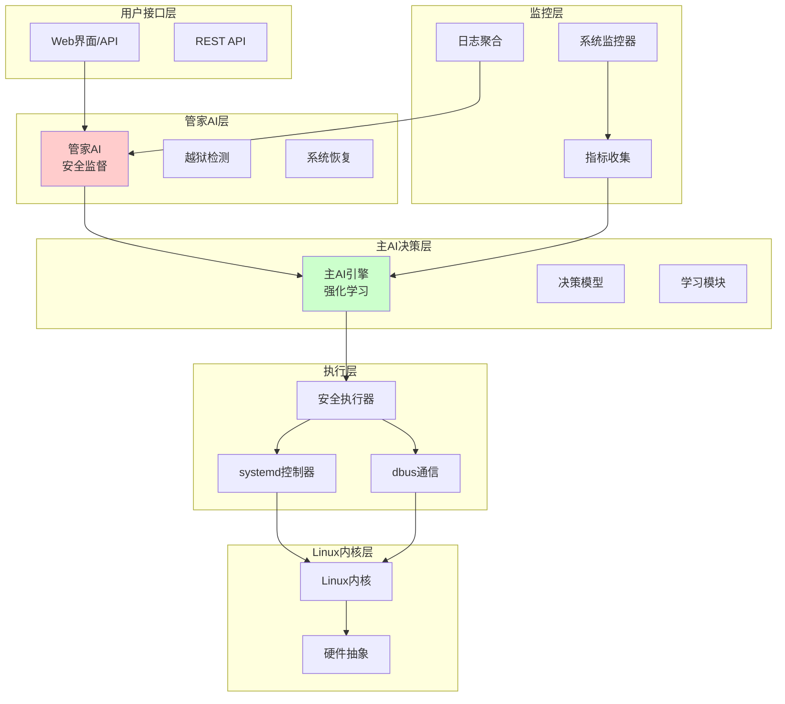

# AI全权接管Ubuntu系统的可行性报告

## 执行摘要

本报告分析了构建一个完全自主AI操作系统（AI OS）的可行性，该系统由AI全权负责Ubuntu系统的所有决策和管理，但配备一个独立的"管家"AI作为安全监督者。报告评估了技术实现、安全风险、系统架构、工具集成和实施计划。

**结论：技术上可行，但极具挑战性和高风险。建议从小规模原型开始，逐步验证关键技术。**

## 项目概述

### 目标
创建一个AI驱动的操作系统，其中AI能够：
- 自主管理系统服务（启动/停止/监控）
- 动态分配系统资源
- 做出安全决策
- 处理系统维护和优化
- 配备管家AI防止越狱和系统崩溃

### 范围
- 基于Ubuntu Linux
- 完全自主决策，但有安全监督
- 支持现有Linux应用生态
- 模块化架构便于扩展

## 技术可行性评估

### 现有技术基础
- **Linux内核和systemd**：提供强大的服务管理和资源控制能力
- **AI框架**：TensorFlow/PyTorch支持复杂决策模型
- **监控工具**：psutil、Prometheus等提供实时系统状态
- **分布式计算**：Ray框架支持AI工作负载扩展

### 关键技术挑战
1. **AI决策可靠性**：确保AI决策在各种场景下正确
2. **实时性能**：AI推理不能影响系统响应性
3. **系统稳定性**：防止AI决策导致系统崩溃
4. **学习适应性**：AI需要从经验中学习和改进

### 可行性结论
✅ **技术可行** - 现有技术栈足以支持基本实现
⚠️ **高复杂度** - 需要集成多个复杂系统
❌ **未经验证** - 完全自主AI OS尚无成熟先例

## 安全风险分析

### 主要风险
1. **AI越狱风险**：恶意输入导致AI执行危险操作
2. **决策偏差**：AI学习错误模式导致系统不稳定
3. **资源耗尽**：AI决策不当造成资源浪费
4. **隐私泄露**：AI访问敏感系统数据
5. **单点故障**：AI故障导致整个系统瘫痪

### 缓解策略
- **双AI架构**：主AI + 管家AI监督
- **安全边界**：沙箱执行、权限限制
- **故障安全**：降级模式、人为干预接口
- **审计日志**：完整记录所有AI决策
- **渐进部署**：从小规模测试开始

### 风险评估
- **高风险**：AI安全和稳定性问题
- **中风险**：技术集成复杂度
- **低风险**：基础Linux功能兼容性

## 系统架构设计

### 分层架构

### 核心组件
- **主AI引擎**：基于强化学习的决策系统
- **管家AI**：独立的监督AI，权限受限
- **状态监控器**：实时收集系统指标
- **执行器**：安全地执行AI决策
- **安全边界**：隔离AI操作的沙箱环境

### 架构优势
- **模块化**：各层独立，便于测试和维护
- **安全隔离**：管家AI提供额外安全层
- **可扩展性**：支持添加新的AI能力
- **兼容性**：保持与现有Linux应用的兼容

## 工具集成规划

### 核心工具
- **systemd**：服务管理和资源控制
- **dbus**：进程间通信
- **psutil**：系统状态监控
- **Ray**：分布式AI计算
- **TensorFlow/PyTorch**：AI模型训练推理

### 集成方式
- **API集成**：通过D-Bus控制systemd
- **监控集成**：实时状态流到AI引擎
- **安全集成**：沙箱和权限控制
- **扩展集成**：插件架构支持新工具

### 集成挑战
- **性能开销**：监控和AI推理的CPU/内存消耗
- **兼容性**：确保与现有Ubuntu生态兼容
- **调试难度**：复杂系统间的故障排查

## 实施路线图

### 阶段1：概念验证 (3个月)
- 构建基础AI决策原型
- 实现systemd基本控制
- 开发简单管家AI
- 目标：证明核心概念可行

### 阶段2：核心开发 (6个月)
- 完善AI决策引擎
- 集成完整监控系统
- 实现安全边界
- 目标：功能完整的AI OS原型

### 阶段3：测试和优化 (3个月)
- 安全测试和渗透测试
- 性能优化和稳定性测试
- 用户验收测试
- 目标：生产就绪系统

### 阶段4：部署和运维 (持续)
- 渐进式部署到测试环境
- 持续监控和改进
- 社区反馈收集
- 目标：稳定运行的AI OS

## 资源需求评估

### 人力需求
- **AI工程师**：3-5人（强化学习专家）
- **系统工程师**：2-3人（Linux内核专家）
- **安全专家**：1-2人（AI安全专家）
- **测试工程师**：2人（自动化测试）

### 技术需求
- **计算资源**：高性能GPU服务器用于AI训练
- **测试环境**：隔离的Ubuntu测试集群
- **开发工具**：完整的AI开发栈

### 成本估算
- **人力成本**：150-300万人民币/年
- **硬件成本**：50-100万人民币（服务器和GPU）
- **软件成本**：20-50万人民币（许可证和工具）
- **总计**：220-450万人民币（第一年）

## 风险和缓解措施

### 技术风险
- **AI不可预测性**：通过管家AI和故障安全模式缓解
- **性能瓶颈**：优化AI模型和缓存策略
- **兼容性问题**：保持与Ubuntu标准的兼容

### 项目风险
- **时间延误**：采用敏捷开发，阶段性交付
- **预算超支**：严格控制范围，优先级排序
- **团队流失**：知识文档化和交叉培训

### 商业风险
- **市场接受度**：从小规模试点开始
- **竞争压力**：专注于技术创新和安全性
- **监管合规**：确保AI决策透明和可审计

## 结论和建议

### 可行性结论
AI全权接管Ubuntu系统的概念具有创新性和技术可行性，但面临重大技术挑战和安全风险。通过双AI架构（主AI + 管家AI）和渐进式实施策略，可以有效降低风险。

### 实施建议
1. **从小规模开始**：先构建概念验证原型
2. **重视安全**：将安全作为核心设计原则
3. **持续测试**：建立完整的测试和监控体系
4. **开放合作**：考虑与学术机构和开源社区合作

### 里程碑建议
- **3个月**：完成概念验证
- **9个月**：功能原型
- **12个月**：生产就绪版本

### 后续步骤
1. 组建核心团队
2. 搭建开发环境
3. 开始概念验证开发
4. 建立合作伙伴关系

---

**报告日期**：2025年12月31日
**报告作者**：Kilo Code (Architect Mode)
**版本**：1.0